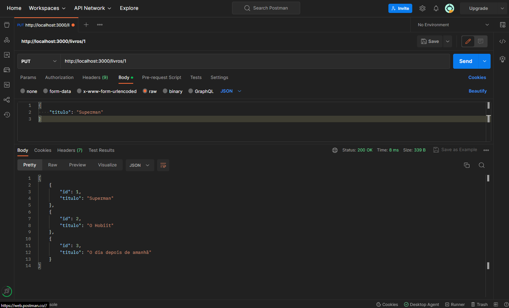

## 💻 Projeto

CRUD para uma Livraria. Onde terá métodos para buscar, cadastrar, atualizar e excluir um livro específico. Sem usar o Banco de Dados e simulando as requisições pelo Postman.

 

## O que aprendi com esse projeto !

<ul>
    <li>
    A instalar o Express e os benefícios de se usar um framework para o desenvolvimento de aplicações Web;
    </li>
    <li>
    Criar um servidor local usando o Express e configurando-o para escutar requisições em uma porta específica do nosso computador;
    </li>
    <li>
    Criar um servidor local usando o Express e configurando-o para escutar requisições em uma porta específica do nosso computador;
    </li>
    <li>
    Como estruturar as requisições da API, utilizando corretamente os verbos HTTP e padronizando o endpoint de acordo com o padrão REST;
    </li>
    <li>
    Devolver dados como resposta às requisições, usando o padrão JSON;
    Utilizar o Postman para fazer as requisições do tipo GET, POST, PUT e DELETE, cujas últimas três não conseguimos simular pelo navegador. Por isso foi necessário usar o Postman para simular as requisições
    </li>
</ul> 

## O que preciso para testar o código ?!  
### Deverá baixar e instalar as tecnologias abaixo 👇
 
<ol>
    <li>Node.js Link: https://nodejs.org/pt-br/download
    </li> 
    <li>Postman Link: https://www.postman.com/  Obs: Poderá também usar a versão web.
    </li>
</ol> 

## Como usar ?

1- Iniciar o npm.

    npm init 

2- Instale o express (4.17.3 é a utimas versao no momento) 

    npm intall express@4.17.3

3- instale a biblioteca para rodar o sevidor automaticamente sempre que salvar o arquivo. 

    instal nodemon@2.0.15

Pepois vá no arquivo package.json e coloque na parte script : "dev": "nodemon server.js". e o "type": "module", também no arquivo packjson.json, para informar que está trabalhando com importação e exportação de modulos.

    "main": "index.js",
    "type": "module",
    "scripts": {
    "dev": "nodemon server.js",
    "test": "echo \"Error: no test specified\" && exit 1"
    },

Para iniciar a API digite no terminal:

    npm run dev

Depois disso, o programa já estará fincionando e ouvindo a porta 3000. Aí é só realizar as requisições no Postman. Bons estudos !!
 

